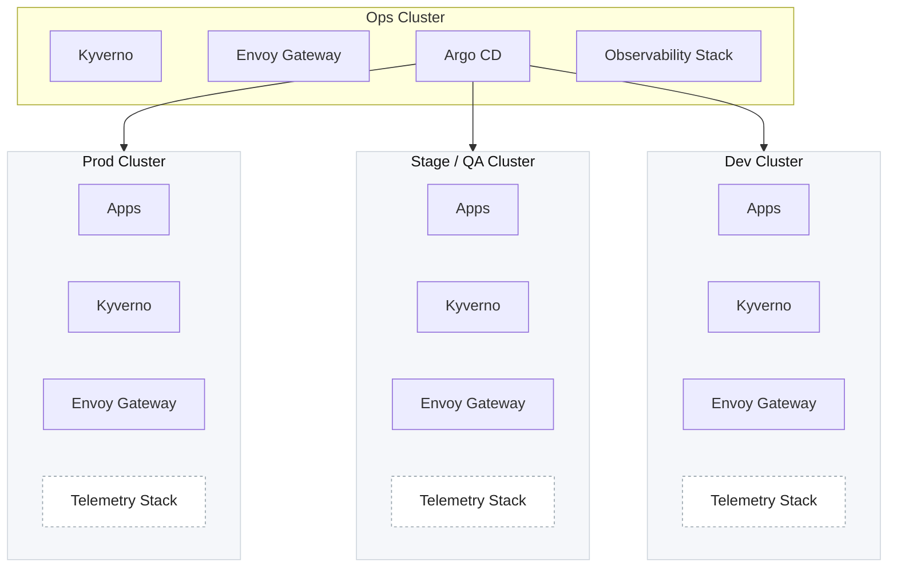
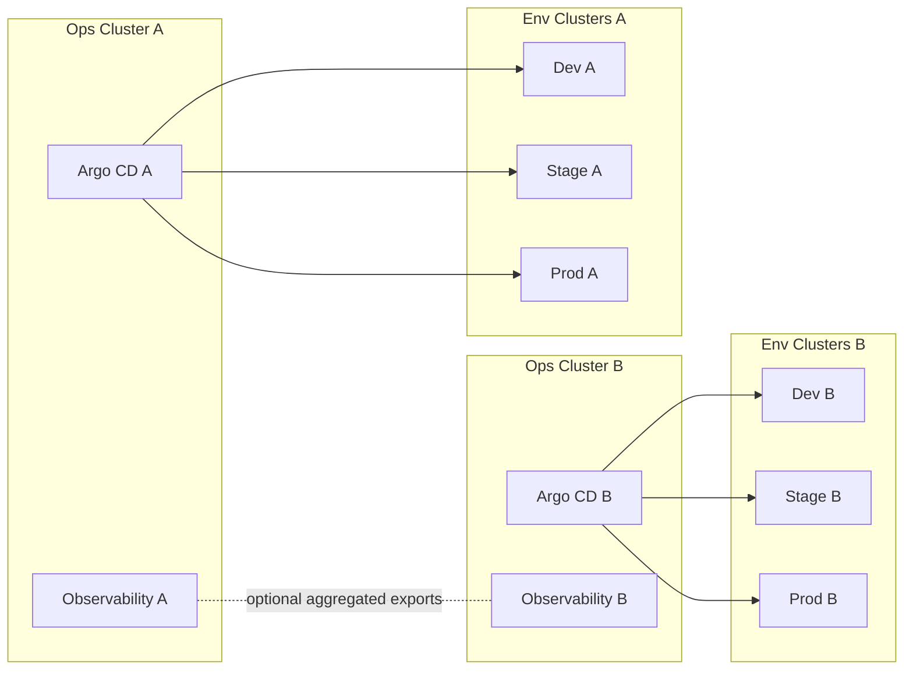
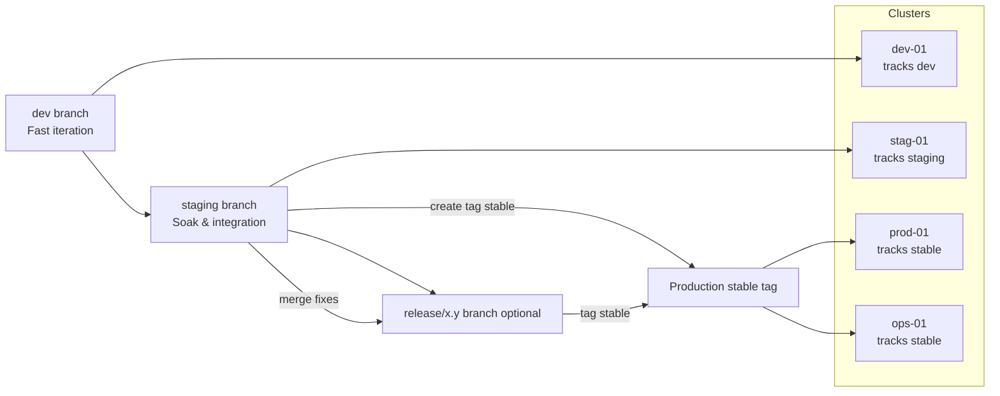

# Helm Charts

[](https://github.com/Thakurvaibhav/k8s/actions/workflows/chart-scan.yml)

## Table of Contents

- [Platform in a Box](#platform-in-a-box)
- [Quick Start](#quick-start)
- [Core Principles](#core-principles)
- [Detailed Component & Architecture Docs](#detailed-component--architecture-docs)
- [Inventory](#inventory)
- [Argo CD Control Plane & Bootstrap](#argo-cd-control-plane--bootstrap)
  - [Global Operations Topology](#global-operations-topology)
  - [Topology Diagram](#topology-diagram)
  - [Multi-Ops Variant](#multi-ops-variant-segregated-control-planes)
  - [Bootstrap Flow](#bootstrap-flow-ops-cluster)
- [Branching & Promotion Model](#branching--promotion-model)
  - [Branch / Tag Roles](#branch--tag-roles)
  - [Visual Flow](#visual-flow)
  - [Promotion Flow](#promotion-flow)
  - [Argo CD Values Alignment](#argo-cd-values-alignment)
  - [Benefits](#benefits)
- [Central Command & Control (Ops Argo CD)](#central-command-control-ops-argocd)
- [Environment Overrides](#environment-overrides)
- [app-of-apps Chart Switches](#app-of-apps-chart-switches-from-valuesyaml-excerpt)
- [Cross‑Chart Relationships](#cross-chart-relationships)
- [DNS & Certificates](#dns--certificates)
- [Security Considerations](#security-considerations)
- [Development & Testing](#development--testing)
- [CI Chart Scan Pipeline](#ci-chart-scan-pipeline)
  - [Steps](#steps)
  - [Outputs](#outputs-in-scan-output)
  - [Local Usage](#local-usage)
  - [Configuration](#configuration-skipping-charts--images)
  - [Additional Per-Chart Controls](#additional-per-chart-controls)
  - [Environment Variables](#environment-variables)
  - [Failure Identification](#failure-identification)
  - [Skipping an Image Temporarily](#skipping-an-image-temporarily)
  - [JUnit Template](#junit-template)
- [Contribution Guidelines](#contribution-guidelines)

## Platform in a Box
These charts implement a "Platform in a Box", a batteries‑included, GitOps driven foundation for operating a Kubernetes platform using the Argo CD App‑of‑Apps pattern. They compose the core traffic, security, observability, data, and enablement layers so teams can onboard applications quickly with consistent guardrails.

Introductory article: [Bootstrapping a Production-Grade Kubernetes Platform](https://medium.com/faun/bootstrapping-a-production-grade-kubernetes-platform-c23fff13a26), narrative walkthrough of goals, architecture choices, and bootstrap flow.

## Quick Start

### Prerequisites
- Kubernetes cluster (v1.27+)
- `kubectl` configured with cluster access
- `helm` v3.8+
- `kubeseal` CLI (for sealed secrets)
- Argo CD installed in ops cluster
- Git repository access
- Object storage bucket (for Thanos metrics)
- DNS provider credentials (for cert-manager and external-dns)

### Infrastructure Provisioning

**Note:** This repository focuses on platform components and assumes you have already provisioned your Kubernetes clusters and cloud infrastructure (VPCs, object storage, DNS zones, etc.) using tools like Terraform, Pulumi, or cloud provider CLIs.

We plan to add opinionated guides for Kubernetes-native infrastructure provisioning using Crossplane or similar tools in the future. For now, please provision your infrastructure using your preferred IaC tool before following the bootstrap steps below.

### 5-Minute Bootstrap

1. **Clone and prepare**:
   ```bash
   git clone <repo-url>
   cd k8s
   ```

2. **Configure environment**:
   - Review `charts/app-of-apps/values.ops-01.yaml`
   - Update cluster endpoints, domains, and secrets
   - Ensure required components are enabled:
     ```yaml
     sealedSecrets:
       enable: true
     certManager:
       enable: true
     envoyGateway:
       enable: true
     ```

3. **Prepare sealed secrets** (if using):
   - Generate sealing key: `kubeseal --fetch-cert > pub-cert.pem`
   - Seal required secrets (DNS credentials, object storage, etc.)

4. **Bootstrap Argo CD**:
   ```bash
   kubectl apply -f argocd-bootstrap-apps/ops-01.yaml
   ```

5. **Verify sync**:
   ```bash
   # Wait for Argo CD to sync (usually 1-2 minutes)
   kubectl get applications -n argocd
   
   # Check specific app status
   argocd app get ops-01-app-of-apps
   
   # Or via Argo CD UI
   argocd app list
   ```

6. **Enable additional components** (via values files):
   ```yaml
   # In values.ops-01.yaml or values.dev-01.yaml
   monitoring:
     enable: true    # For metrics (Prometheus/Thanos)
   logging:
     enable: true    # For centralized logs (Elasticsearch)
   envoyGateway:
     enable: true    # For ingress (Gateway API)
   kyverno:
     enable: true    # For policy enforcement
   ```

### Next Steps
- Go through the [Getting Started Guide](docs/getting-started.md) for a step-by-step walkthrough
- See [Bootstrap Flow](#bootstrap-flow-ops-cluster) for detailed deployment steps
- Explore [Component Documentation](docs/) for architecture deep-dives
- See the [FAQ](docs/faq.md) for common questions and answers
- For troubleshooting and common issues, see the [Troubleshooting Guide](docs/troubleshooting.md)

## Core Principles
- Git as the single source of truth (no snowflake clusters)
- Declarative, immutable desired state (Helm + Argo CD Applications)
- Layered composition (bootstrap → platform services → workloads)
- Secure by default (sealed / encrypted secrets, least privilege)
- Idempotent & repeatable bootstrap (App‑of‑Apps orchestrates order)
- Progressive enablement (feature flags via values: enable only what you need)
- Environment parity with scoped overrides (values.<env>.yaml)

This top‑level document inventories charts, their relationships, and recommended installation / reconciliation order.

### Detailed Component & Architecture Docs
The `docs/` folder contains deep‑dive guidance, reference architectures, and operational playbooks for major platform pillars. Use these for design decisions, hardening steps, and lifecycle operations beyond the high‑level overview in this README:

- [Architecture Decision Records (ADRs)](docs/adr/) – Documented rationale for major architectural choices (App-of-Apps pattern, Thanos, Envoy Gateway, Sealed Secrets, topology decisions).
- [Argo CD Best Practices](docs/argocd-best-practices.md) – HA setup, custom labels, Redis/Valkey guidance, Gateway exposure, metrics scraping.
- [Observability (Metrics, Logs, Traces)](docs/observability.md) – Thanos federation model, Elastic logging, Jaeger design, mTLS patterns, retention & ILM.
- [Traffic Management (Gateway API, TLS, DNS)](docs/traffic-management.md) – Envoy Gateway deployment, certificate issuance flows, DNS automation, sync wave ordering.
- [Policy & Compliance](docs/compliance.md) – Kyverno audit→enforce ladder, Checkov shift‑left scanning, exception handling strategy.
- [Elasticsearch Best Practices](docs/elastic-best-practices.md) – Node role segregation, mTLS external access, heap sizing, ILM, GC & recovery tuning.

These documents evolve independently of this summary; always consult them first for implementation specifics, security hardening steps, and operational playbooks.

## Inventory
| Chart | Category | Purpose | Depends On / Cooperates With | Key Notes |
|-------|----------|---------|------------------------------|-----------|
| `app-of-apps` | GitOps Orchestration | Argo CD App‑of‑Apps root that defines Argo CD `Application` objects for platform components (monitoring, ingress, gateway, secrets, policies, data services, logging). | Argo CD CRDs present in cluster. Optionally Sealed Secrets controller if you enable secret management here. | Toggle components via values: `sealedSecrets`, `ingressController`, `envoyGateway`, `externalDns`, `certManager`, `monitoring`, `kyverno`, `redis`, `valkey`, `logging`, `jaeger`. |
| `sealed-secrets` | Secrets Management | Vendors upstream Bitnami Sealed Secrets controller and (optionally) renders shared/global sealed secrets. | Installed via `app-of-apps` (if `sealedSecrets.enable=true`). Consumed by charts needing encrypted creds (monitoring, external-dns, others). | Supports user‑defined controller key; global secrets only. |
| `cert-manager` | TLS & Certificates | Issues TLS certs via ACME (DNS‑01 GCP Cloud DNS example) and reflects cert Secrets cluster‑wide using reflector. | Sealed Secrets (for DNS svc acct), ExternalDNS (aligned DNS zones), consumers: envoy-gateway, logging, jaeger, ingress. | Upstream `cert-manager` + `reflector`; wildcard cert reuse via annotations. |
| `envoy-gateway` | Traffic Management & Routing | Deploys Envoy Gateway (Gateway API) plus custom GatewayClasses, Gateways, Routes, security & proxy policies. | Kubernetes >=1.27, optionally ExternalDNS & monitoring. | Deployed in every cluster (local ingress + policy attachment) but managed centrally. |
| `external-dns` | Traffic Management & Routing | Manages DNS records in Google Cloud DNS for Services & Gateway API (HTTPRoute/GRPCRoute). | GCP service account (sealed credentials), Gateway / Services to watch. | Multi‑domain filters, TXT registry, environment isolation. |
| `monitoring` | Observability: Metrics | Prometheus + Thanos components for HA metrics and global aggregation. | `envoy-gateway` (if gRPC exposure), Sealed Secrets, object storage. | Values control Thanos, replicas, routes, TLS. |
| `nginx-ingress-controller` | Traffic Management & Routing | Traditional NGINX ingress controller for legacy ingress use cases. | None (cluster only). | Prefer Gateway API for new services. |
| `kyverno` | Compliance & Policy | Upstream Kyverno + Policy Reporter + starter ops & security policies (Audit → Enforce). | Sealed Secrets (optional), monitoring (metrics). | Deployed in every cluster for local admission & policy enforcement; centrally versioned. |
| `redis` | Data Services (Shared) | Vendors upstream Bitnami Redis for cache/session workloads. | Sealed Secrets (auth), monitoring (metrics). | Enable auth & persistence in env overrides before production. **Note:** Bitnami is deprecating free images; consider migrating to `valkey` (drop-in Redis replacement). |
| `valkey` | Data Services (Shared) | High-performance Redis fork for cache/session workloads. Drop-in replacement for Redis with modern features. | Sealed Secrets (auth), monitoring (metrics). | Recommended alternative to Redis. Currently supports replication mode; Sentinel mode coming soon. Enable auth & persistence in env overrides before production. |
| `logging` | Observability: Logs | Centralized multi‑cluster logging (Elasticsearch + Kibana + Filebeat) using ECK operator & mTLS via Gateway. | `envoy-gateway` (ingest endpoint), Sealed Secrets (certs), eck-operator. | Deployed with Helm release name `logging`; ops cluster hosts ES/Kibana; other clusters ship via Filebeat. |
| `jaeger` | Observability: Tracing | Multi‑cluster tracing (collectors in all clusters, query UI only in Ops) storing spans in shared Elasticsearch (logging stack). | `logging` (Elasticsearch), Sealed Secrets (ES creds / TLS), optional Envoy Gateway (if exposing query). | Agents optional (apps can emit OTLP direct); uses upstream Jaeger chart. |

## Argo CD Control Plane & Bootstrap
Argo CD runs in the **ops cluster** (namespace `argocd`) and serves as the central command & control plane for *all* platform components across every environment cluster. The ops cluster hosts:
- Argo CD core controllers / repo servers
- The App-of-Apps root installation (via the `app-of-apps` chart) for the ops cluster itself
- Bootstrap Application manifests located under `argocd-bootstrap-apps/` (e.g. `ops-01.yaml`) which create the root Application pointing at the `app-of-apps` Helm chart

From this root, Argo CD renders and manages per‑cluster component Applications (monitoring, logging, jaeger, gateway, cert-manager, kyverno, etc.). Remote clusters are registered in Argo CD (cluster secrets) and targeted by generated `Application` specs; reconciliation therefore originates centrally while resources apply to their respective destination clusters.

### Global Operations Topology
The **Ops cluster** functions as the *global command center*:
- Hosts the authoritative Argo CD control plane (API, repo-server, controllers)
- Runs centralized observability backends (Grafana, Thanos Global Query, Elasticsearch/Kibana, Jaeger Query) and shared gateway / policy components
- Provides a single RBAC + audit surface for promotions & rollbacks
- Exposes only the minimum required northbound endpoints (UI/API, metrics, routes)

**Workload Environment Clusters** (Dev, QA/Stage, Prod) connect outward to the Ops control plane:
- Applications & platform components deploy *into* those clusters via Argo CD Application destinations
- Metrics / logs / traces federate back (pull or push depending on component) to the Ops cluster’s aggregation layer
- Promotion flows (dev → staging → prod) are purely Git-driven; clusters never need inbound access to each other

#### Core Assertions
1. Ops cluster = authoritative source of deployment orchestration & cross‑environment visibility.
2. Dev / QA / Prod clusters are *execution targets*; they do not run their own Argo CD (unless intentionally delegated).
3. Multiple Ops clusters are possible (e.g. per regulatory boundary, geography, or business unit) — each managing a *scope* of environment clusters.
4. Observability backends can be hierarchical (regional Ops aggregators → global Ops) if needed for scale or sovereignty.
5. Envoy Gateway and Kyverno run in every cluster to keep ingress and policy enforcement local (reduced latency, fail‑closed posture) while remaining Git‑driven from the Ops control plane.

### Topology Diagram


### Multi-Ops Variant (Segregated Control Planes)
When mandated by isolation (e.g., regulated vs commercial, or geo latency), run *multiple* Ops clusters—each an island of control—but optionally feed a higher‑level analytics layer.



**Guidance**
- Start with a single Ops cluster unless compliance / latency clearly requires separation.
- If splitting, standardize naming (e.g., `ops-global`, `ops-regulated`) and duplicate only the minimal control plane + observability roles.
- Keep Git repository structure unified; scope Argo CD Projects per Ops domain.

### Bootstrap Flow (Ops Cluster)
1. Apply the bootstrap Application (e.g. `kubectl apply -f argocd-bootstrap-apps/ops-01.yaml` in the ops cluster).
2. The bootstrap Application installs the `app-of-apps` chart with the appropriate `values.<env>.yaml` (e.g. `values.ops-01.yaml`).
3. The chart renders per‑component `Application` CRs for the ops cluster (and optionally for other clusters if multi-cluster definitions are embedded or generated via environment-specific invocations).
4. Subsequent clusters repeat with their corresponding bootstrap file (e.g. `argocd-bootstrap-apps/dev-01.yaml`) referencing the same repo but a different values file.

Result: a **single Argo CD UI** orchestrating desired state across all clusters;
rollback, sync, health, and diff inspection are centralized.

## Branching & Promotion Model
A consistent branching & promotion workflow governs both:
1. The **component charts** (in `charts/`) and
2. The **Argo CD Application definitions** (Helm values & templates under `app-of-apps` and bootstrap manifests).

### Branch / Tag Roles
| Stage | Git Reference | Purpose | Typical Cluster(s) |
|-------|---------------|---------|--------------------|
| Development | `dev` branch | Fast iteration; immediate merges & validation | `dev-01` |
| Staging | `staging` branch | Pre‑production soak / integration tests | `stag-01` |
| Production | `stable` tag (cut from `staging`) | Immutable, audited release for production | `prod-01` |
| Operations / Control | Follows `stable` or pinned tag per component | `ops-01` (control plane) |

Optional: Create `release/x.y` branch off `staging` prior to tagging `stable` for more complex hardening windows.

### Visual Flow

**Sequence Summary**
1. Work lands on `dev` (fast commits).
2. `staging` branch created from a dev snapshot for soak.
3. Optional `release/x.y` branch split for hardening.
4. Fixes merged back into `staging`.
5. `stable` tag cut from hardened branch (or staging) → production.



Explanation:
- Developers merge to `dev` → auto-syncs `dev-01`.
- Periodic promotion (merge) moves tested commits to `staging` → syncs `stag-01`.
- Optional `release/x.y` branch isolates final hardening; fixes flow back to `staging`.
- Tag `stable` on vetted commit (from `release/x.y` or `staging`) → `prod-01` + `ops-01` reconcile that immutable reference.
- Emergency prod fix: branch off `stable` (or `release/x.y`), apply fix, retag `stable`, then forward-merge to `staging` & `dev` to avoid divergence.

### Promotion Flow
1. Developer merges change (chart template / values / policy) → `dev` branch auto-syncs in `dev-01`.
2. After validation, PR merges `dev` → `staging` (or cherry-pick) → Argo CD syncs `stag-01` using that branch.
3. When ready, create / move the `stable` tag to the desired commit on `staging`.
4. `prod-01` (and ops control plane components requiring production parity) track `stable` ensuring deterministic deployments.

### Argo CD Values Alignment
Environment values files (e.g. `charts/app-of-apps/values.prod-01.yaml`) set:
```
source.targetRevision: stable   # prod
source.targetRevision: staging  # stag-01
source.targetRevision: HEAD     # dev-01 (or dev)
```
Adjust these to match your exact branch names (e.g., replace `HEAD` with `dev` if you prefer explicit branch). The same `targetRevision` semantics apply for every enabled component because the `app-of-apps` chart propagates defaults unless overridden at a component block.

### Benefits
- Clear provenance: production always references an immutable tag.
- Fast experimentation isolated to dev branch & cluster.
- Staging soak ensures operational dashboards / alerts validate before tagging.
- Uniform model reduces cognitive load when diagnosing drift (branch vs tag mismatch quickly visible in `Application` spec).

## Central Command & Control (Ops Argo CD) <a id="central-command-control-ops-argocd"></a>
Argo CD in the ops cluster functions as the operational nerve center:
- Aggregated health: UI shows all cluster Applications (`<cluster>-<component>` naming convention)
- Centralized RBAC: limit who can promote by controlling write access to `staging` and `stable` tag creation
- Single audit trail: Git history + Argo CD event log for every rollout / rollback
- Simplified credential & secret management: sealed secrets decrypted only within target clusters; definitions managed centrally
- Coordinated policy evolution: Kyverno & other governance changes rolled out progressively via promotion pipeline

If Argo CD control plane outage occurs, existing workloads remain running; only reconciliation pauses. Recovery: restore ops cluster or Argo CD deployment, reapply bootstrap Application if necessary—state rehydrates from Git.

## Environment Overrides
Each chart provides environment value files:
```
values.dev-01.yaml
values.stag-01.yaml
values.ops-01.yaml
values.prod-01.yaml
```
Use the matching file (or merge multiple with `-f`).

## app-of-apps Chart Switches (from `values.yaml` excerpt)
```
sealedSecrets.enable        # sealed-secrets controller + global secrets
certManager.enable          # cert-manager + reflector for certificate issuance
externalDns.enable          # external-dns controller for DNS records
ingressController.enable    # nginx ingress controller
envoyGateway.enable         # envoy gateway platform ingress
monitoring.enable           # monitoring stack (Prometheus/Thanos)
kyverno.enable              # kyverno policies + reporter
redis.enable                # redis data service (consider valkey instead)
valkey.enable               # valkey data service (recommended Redis alternative)
logging.enable              # elastic logging stack (Helm release name: logging)
jaeger.enable               # distributed tracing (Jaeger collectors + optional query UI)
```
Each block also supplies:
- `project`: Argo CD Project name
- `namespace`: Target namespace for component
- `source.repoURL` / `path` / `targetRevision`
- Optional Helm release metadata under `helm`

## Cross‑Chart Relationships <a id="cross-chart-relationships"></a>
- Monitoring gRPC exposure uses Envoy Gateway for external Thanos Query.
- ExternalDNS publishes hosts from Envoy Gateway (Gateway API) & any ingress objects.
- Cert-Manager issues wildcard / SAN certs consumed by Envoy Gateway, logging (Kibana/ES ingress), Jaeger Query, and any legacy ingress objects; reflector replicates cert secrets.
- Logging relies on Envoy Gateway for mTLS log ingestion endpoints and Sealed Secrets for TLS cert material.
- Jaeger collectors write spans to Elasticsearch in the logging stack; Query UI only runs in Ops cluster; optional exposure via Envoy Gateway / ingress.
- Jaeger agents are optional when applications can emit OTLP direct to collector services.
- Kyverno enforces standards on workloads deployed by other charts (progress Audit→Enforce) and operates per cluster for locality of admission decisions.
- Envoy Gateway is present in each cluster for local north/south & east/west routing; global Gitops ensures consistent security policy overlays.
- Redis/Valkey, Logging Stack, and Jaeger may expose metrics scraped by monitoring.
- Sealed Secrets underpins secret distribution (monitoring, external-dns, kyverno, redis, valkey, logging, jaeger, cert-manager DNS creds).

## DNS & Certificates
- Ensure Cloud DNS zones exist for all `external-dns` domains.
- Cert-Manager handles ACME issuance (DNS-01) and reflector replicates certificate secrets where needed.
- Seal or externally manage TLS and client certs for specialized mTLS (e.g., logging ingest) separate from public certs.

## Security Considerations
- Principle of least privilege for service accounts & secrets.
- Rotate sealed secrets periodically.
- Enforce policies with Kyverno only after Audit stabilization.
- Enable Redis/Valkey auth & persistence before production use.
- Protect Elasticsearch & Kibana with auth + mTLS where applicable.
- Secure Jaeger Query with OAuth / SSO and TLS; ensure collectors use mTLS to ES.

### Bitnami Image Deprecation Notice
Bitnami is deprecating free container images, which affects charts that depend on Bitnami images (notably the `redis` chart). **We recommend migrating to `valkey`**, which is a drop-in replacement for Redis with:
- Continued open-source support and active development
- Redis protocol compatibility (drop-in replacement)
- Modern performance improvements and features
- No dependency on deprecated Bitnami images

The `valkey` chart provides the same functionality as `redis` with improved long-term maintainability.

## Development & Testing
```bash
helm template monitoring ./monitoring -f monitoring/values.dev-01.yaml | less
helm lint monitoring
```

## CI Chart Scan Pipeline
A GitHub Actions workflow runs a chart scan matrix with three steps: `lint`, `trivy`, and `checkov`. Only charts changed in the current diff to `origin/master` are scanned (unless `--all` is used).

Script: `scripts/scan.sh`

### Steps
- lint: Renders each chart+values (Helm template) and checks for accidental double document separators (`---\n---`).
- trivy: Extracts container images from rendered manifests and performs vulnerability scanning (JUnit XML per image + consolidated `trivy-image-report.txt`). Duplicate images across charts are scanned once (in-memory cache).
- checkov: Runs Checkov against each chart with its values file using the Helm framework, producing JUnit XML output.

### Outputs (in `scan-output/`)
- `test-results/*.xml` (JUnit per scan/image)
- `${STEP}-test-results.html` (if `xunit-viewer` installed in CI)
- `trivy-image-report.txt` (only for `trivy` step; line: `<image> <OK|FAIL|SKIPPED|CACHED>`)
- `scan-summary.txt` (aggregate counts & failures)

### Local Usage
```bash
# Lint only changed charts
scripts/scan.sh lint

# Scan all charts with Trivy (include images not in diff)
scripts/scan.sh trivy --all

# Include HIGH severities too
TRIVY_SEVERITY=CRITICAL,HIGH scripts/scan.sh trivy

# Ignore unfixed vulnerabilities
TRIVY_IGNORE_UNFIXED=true scripts/scan.sh trivy

# Keep rendered manifests beside charts
KEEP_RENDERED=1 scripts/scan.sh lint

# Custom config location
CONFIG_FILE=my-scan-config.yaml scripts/scan.sh checkov
```

### Configuration (Skipping Charts / Images)
Skips are defined in `scan-config.yaml` (or file pointed to by `CONFIG_FILE`). Example:
```yaml
trivy:
  skipcharts:
    - redis            # skip all images for this chart
  skipimages:
    - ghcr.io/org/tooling-helper:latest   # skip a specific image fully
checkov:
  skipcharts:
    - logging          # skip Checkov for this chart
```
Place the config at repo root (default path) or set `CONFIG_FILE`.

### Additional Per-Chart Controls
- `.trivyignore` inside a chart: Standard Trivy ignore rules (CVE IDs etc.).
- `.checkov.yaml` inside a chart: Merged with `.globalcheckov.yaml` (local file may remove global `check` entries if they appear in `skip-check`).

### Environment Variables
| Variable | Purpose | Default |
|----------|---------|---------|
| `TRIVY_SEVERITY` | Severities to fail on (comma list) | `CRITICAL` |
| `TRIVY_IGNORE_UNFIXED` | Ignore vulns without fixes | `false` |
| `CONFIG_FILE` | Path to scan config | `scan-config.yaml` |
| `KEEP_RENDERED` | Keep rendered manifests (1/0) | `0` |
| `CONCURRENCY` | (Reserved) future parallelism | `4` |
| `YQ_CMD` | `yq` binary name | `yq` |
| `OUTPUT_DIR` | Output root | `./scan-output` |

### Failure Identification
`scan-summary.txt` fields:
- Charts processed / Values processed
- Images scanned / skipped / failed (Trivy step)
- Failed items (list of tokens `Kind:Detail[:...]`)

Kinds emitted today:
- `Render:<chart>:<values>` (render failure)
- `DoubleDoc:<chart>:<values>` (duplicate document separator)
- `Checkov:<chart>:<values>` (Checkov non-zero)
- `Trivy:<image>:<chart>:<values>` (image vuln failure)
- `Deps:<chart>` (helm dependency build failed)
- `NoChart:<chart>` (missing `Chart.yaml`)

### Skipping an Image Temporarily
Add it under `trivy.skipimages` in the config file and re-run the `trivy` step. The summary will reflect `Images skipped` count; the image will appear with status `SKIPPED` in `trivy-image-report.txt`.

### JUnit Template
The Trivy JUnit output uses `@./scripts/junit.tpl`. Adjust this path if relocating the template.

## Contribution Guidelines
- Update per‑chart README on changes.
- Keep inventory table aligned with actual charts.
- Bump chart versions on template/value default changes.
- Update CI scan docs above if scan behavior or config keys change.

