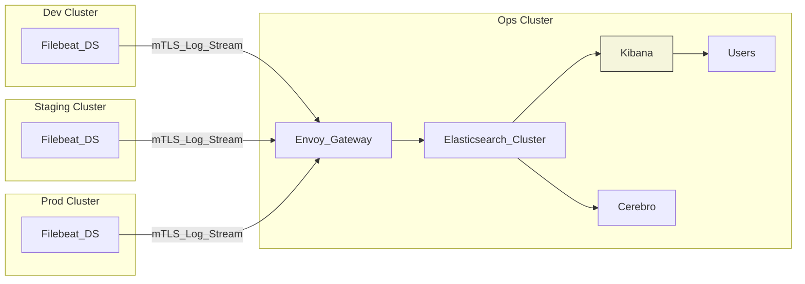

# elastic-stack Helm Chart

## Overview
Deploys a multi‑cluster logging platform using the Elastic Stack (Elasticsearch + Kibana + Filebeat) managed by the ECK Operator. The pattern centralizes storage and visualization in an operations (ops) cluster while remote clusters ship logs securely over mTLS via the Gateway API.

## Architecture Summary
- ECK Operator (dependency) installs CRDs/controllers.
- Ops cluster: Runs Envoy Gateway (ingest edge), Elasticsearch data/control plane, Kibana UI, optional Cerebro.
- Remote clusters: Run Filebeat DaemonSets that forward logs to the ops cluster (direct mTLS to Envoy Gateway endpoint).
- Connectivity: Filebeat -> Envoy Gateway (mTLS) -> Elasticsearch ingest endpoints.
- Optional: Cerebro administrative UI (if enabled) for cluster health insights.

## Dependency
Declared in `Chart.yaml`:
```
dependencies:
  - name: eck-operator
    version: 0.1.0
    repository: file://../eck-operator
    condition: eckOperator.enable
    alias: eckOperator
```
Set `eckOperator.enable=true` to bundle the operator; otherwise ensure operator already present.

## High-Level Data Flow (Mermaid)


## Traffic & Security
| Aspect | Mechanism |
|--------|-----------|
| Transport security | mTLS via Gateway API (Certificates per cluster / client) |
| AuthN/AuthZ (optional) | Elasticsearch users / API keys / Fleet integration |
| Network exposure | Only Gateway Listener ports reachable from remote clusters |
| Multi‑cluster isolation | Distinct client certs or JWT/OIDC tokens per environment |

## Values (Conceptual Excerpt)
(Actual keys depend on your `values.*.yaml` definitions; extend below as you add templates.)
```
eckOperator:
  enable: true

elasticsearch:
  replicas: 3
  storage:
    size: 200Gi
  resources:
    requests:
      cpu: 1
      memory: 4Gi

kibana:
  enable: true
  replicas: 2

filebeat:
  remoteClusters:
    - name: dev-01
      endpoint: logs.example.com:443
      tls:
        ca: <sealed>
        cert: <sealed>
        key: <sealed>
```

## Deployment Patterns
| Pattern | Description |
|---------|-------------|
| Centralized (default) | Single ops cluster runs ES+Kibana. Others ship logs only. |
| Standalone | Enable in one cluster only (operator + ES + Kibana + local Filebeat). |

## Install (Ops Cluster)
```bash
helm dependency update ./elastic-stack
helm upgrade --install elastic-stack ./elastic-stack -f elastic-stack/values.ops-01.yaml -n logging --create-namespace
```

## Remote Cluster Setup
1. Ensure ECK Operator PRESENT only if you intend local Elastic resources (not required for pure Filebeat shipping).
2. Deploy `filebeat` DaemonSet pointing to the ops Gateway hostname.
3. Provide mTLS client cert/key and CA (sealed or via External Secrets) matching Gateway TLS policy.

## Scaling Elasticsearch
| Component | Scale Lever |
|-----------|-------------|
| Data nodes | Increase `replicas`, add nodeSets with tailored roles |
| Ingest throughput | Add dedicated ingest nodes or autoscale resources |
| Query performance | Increase CPU/memory, add coordinating-only nodes |
| Storage | Expand PVC sizes or add nodeSets with larger volumes |

## Retention & ILM
Define index lifecycle policies (ILM) to transition data: hot → warm → cold → delete. Keep only necessary retention for compliance / troubleshooting to control costs.

## Cerebro (Optional)
If enabled, provides a lightweight UI to inspect cluster health, nodes, and indices. Restrict access (NetworkPolicy + auth) and prefer Kibana for day‑to‑day observability.

## Observability Integration
- Filebeat internal metrics can be scraped and sent to Prometheus (add ServiceMonitor).
- Elasticsearch & Kibana expose metrics endpoints; secure with auth.
- Dashboards: Kibana for log exploration; integrate alerts with existing alerting stack.

## Backup & Recovery
- Snapshot repository (e.g., GCS / S3) configured for regular snapshots.
- Disaster recovery: restore operator, CRDs, snapshot repo configuration, then restore indices.

## Upgrades
1. Upgrade operator first (if required).
2. Apply CRD changes.
3. Roll ES version within supported upgrade path.
4. Validate cluster green status after each phase.

## Security Hardening Checklist
- Enable auth (native realm / OIDC) and disable anonymous access.
- Restrict Kibana exposure; require SSO for user access.
- Use index templates & ILM to prevent uncontrolled shard growth.
- Monitor heap usage; right‑size JVM options per node type.

## License
Internal use unless otherwise specified. Upstream Elastic components subject to Elastic licensing.
