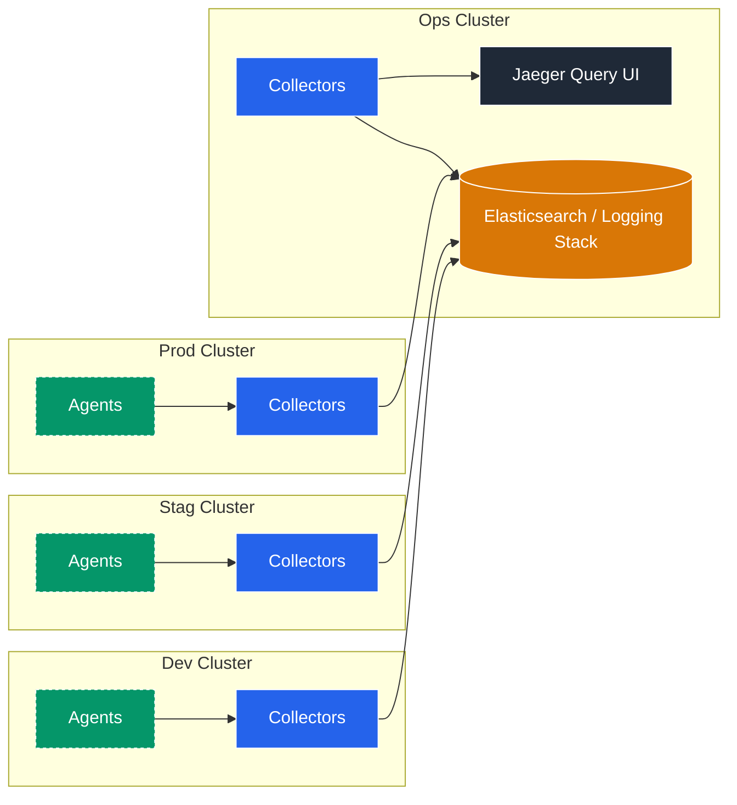

# jaeger Chart

## Overview
This chart wraps (vendors) the upstream Jaeger Helm chart (`jaeger` dependency in `Chart.yaml`) to provide an opinionated, multi‑cluster tracing deployment. It focuses on:
- Centralized query UI running only in the Ops (observability) cluster.
- Distributed collection (agent + collector) across all clusters.
- Elasticsearch (ES) as the storage backend (shared logging / elastic-stack ES cluster in the Ops cluster).
- Secure TLS (mTLS) connectivity from Jaeger collectors to Elasticsearch (same Ops cluster).
- Optional OAuth2 proxy in front of Jaeger Query.

## Upstream Reference
Upstream chart: https://github.com/jaegertracing/helm-charts (dependency `jaeger`).
This wrapper supplies defaults, secret mounts, and multi‑cluster role separation.

## Architecture
Jaeger comprises several components; this opinionated layout splits responsibilities:
- Agents: (Optional) DaemonSet/sidecars near workloads for UDP -> OTLP translation or local buffering. If applications natively emit OTLP gRPC/HTTP you can skip deploying agents and point apps directly at the collector service.
- Collectors: Receive spans (gRPC/HTTP OTLP), batch & write to Elasticsearch.
- Query: Provides UI + API (Centralized ONLY in Ops cluster).
- Optional OAuth sidecar for authenticated access.
- Elasticsearch: Runs in the Ops cluster (provided by the shared logging `elastic-stack` chart) – not provisioned here.

## Multi‑Cluster Pattern
- Non‑Ops clusters: Deploy Collectors (Agents optional per application capability). Query disabled.
- Ops cluster: Deploy Collectors + Query + (optionally Agents if workloads run here). ES/logging stack co‑located.
- All collectors write to the Elasticsearch cluster in Ops over TLS.

## Storage Backend: Elasticsearch
Values set `jaeger.storage.type=elasticsearch`. The chart does NOT provision ES; instead it consumes the existing logging stack (elastic-stack) in the Ops cluster:
- Credentials (user/password) via existing secret (`es-user-secret`).
- mTLS certs (CA + client cert/key) via a SealedSecret rendered as `es-tls-secret`.

## Security
- mTLS for ES traffic (CA + client cert/key mounted at `/es-tls/`).
- Optional OAuth2 proxy protects Query UI (enable `query.enabled=true` + `query.oAuthSidecar.enabled=true`).
- Secrets managed via Sealed Secrets (place encrypted values in `values.*.yaml`).

## Configuration Highlights (`values.yaml`)
- `namespace`: Target namespace.
- `jaeger.storage.elasticsearch.host`: External ES host (TLS enabled).
- `jaeger.storage.elasticsearch.existingSecret`: Reference for ES password.
- `jaeger.collector.extraSecretMounts`: Mount mTLS cert bundle.
- `jaeger.query.enabled`: Disabled in non‑Ops clusters; enable only in Ops.
- `jaeger.query.oAuthSidecar.*`: Configure OAuth2 proxy settings (client ID/secret via sealed secret).
- `esSecret.*`: Encrypted (sealed) PEM material for CA, client cert/key.

## Enabling Query in Ops Cluster
1. In `values.ops-01.yaml`, set:
```
jaeger:
  query:
    enabled: true
```
2. (Optional) Enable OAuth sidecar:
```
jaeger:
  query:
    oAuthSidecar:
      enabled: true
      # adjust redirect_url, client_id, cookie_secret
```
3. Expose via Gateway / Ingress (e.g., enable `query.httpRoute.enabled=true` or add Ingress manifest).

## Sealed Secrets
Create sealed secrets for:
- `es-tls-secret` (CA + client cert/key PEMs)
- `es-user-secret` (ES_PASSWORD)
- `oauth-secret` (clientId / clientSecret if OAuth enabled)

## Deployment Flow
1. Ops cluster values enable Query; other clusters leave it disabled.
2. Apply / Argo CD sync ensures collectors everywhere, single Query centrally.
3. (Optional) Deploy agents only where workloads need them; otherwise apps send OTLP directly to collector services.
4. Collectors write spans to Elasticsearch (Ops) over mTLS.
5. Users access Query UI (OAuth protected if enabled) to search traces.

## Mermaid Architecture Diagram


## Initial Index / ILM Setup
Run the rollover/ILM initialization once (after ES is ready) so Jaeger indices and ILM policies exist before heavy traffic:
```
docker run -it --rm \
  -e ES_USE_ILM=true \
  --net=host \
  jaegertracing/jaeger-es-rollover:latest init \
  https://elastic.mydomain.com:443 \
  --es.username <es_user> \
  --es.password <es_pass> \
  --es.tls.skip-host-verify \
  --es.tls.enabled \
  --index-prefix jaeger-ops-01
```
Adjust host / credentials / prefix per environment. Re-run only if changing index prefix or ILM policy.

## Notes
- Elasticsearch cluster shared with logging stack (elastic-stack) and resides only in Ops cluster.
- Agents are optional; prefer direct OTLP export from applications to collector when feasible (reduce resource overhead).
- Index management: `es.use-ilm=true` and `es.use-aliases=true` configured; ensure ES supports ILM policies.

## License
Internal use only unless stated otherwise.
