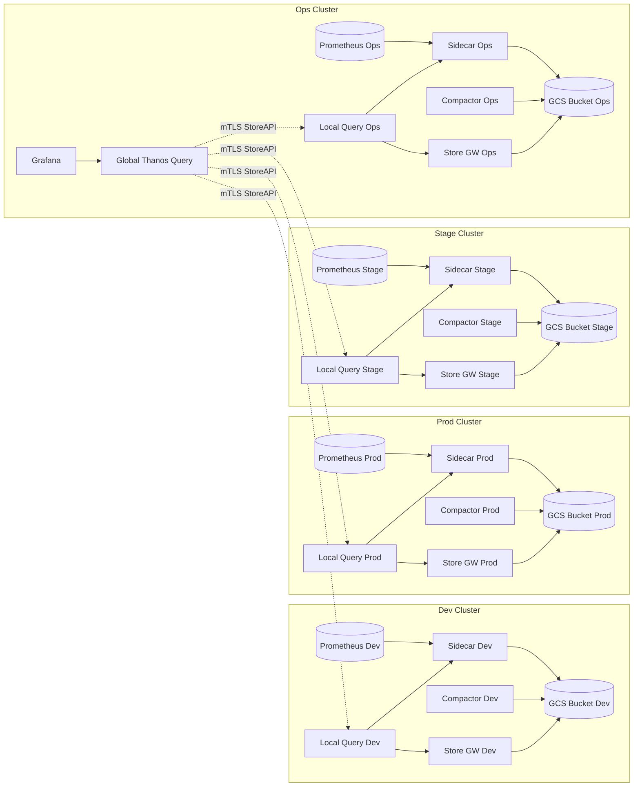

# monitoring Helm Chart

## Overview
The `monitoring` chart deploys a highly available Prometheus stack integrated with Thanos for global, long‑term, and cost‑efficient metrics storage. Multiple cluster Prometheus pairs (replicas) ship metrics to object storage via the Thanos sidecar. Thanos Query layers unify data into ONE Single Pane of Glass for all environments (Dev, Stage, Prod, Ops) through a central Grafana in the ops cluster.

> Single Pane of Glass: Grafana (Ops) + Global Thanos Query aggregate real‑time and historical metrics seamlessly across Dev, Stage, Prod, and Ops clusters over secure mTLS.

## Features
- HA Prometheus (replicas for resilience & zero-ish scrape gap failover)
- Thanos Sidecar for each Prometheus to ship & expose TSDB blocks
- Global aggregation via Thanos Query (single pane of glass)
- Optional Thanos Store / Compactor / Ruler components (if enabled in values)
- Long‑term & durable retention in GCS (object storage)
- Central Grafana (external to this chart) consumes unified Thanos endpoint
- Optional gRPC exposure of Thanos Query through Gateway API (Envoy Gateway) with mTLS
- SealedSecrets for secure delivery of TLS certs & GCS bucket credentials
- Environment specific values overrides (`values.dev-01.yaml`, `values.stag-01.yaml`, etc.)

## Important Templates
- `templates/thanos/` (e.g. `thanos-query-route.yaml`): Routing, TLS & mTLS policy (only rendered when enabled)
- Additional Prometheus / Thanos component manifests (refer to chart templates directory)

## High-Level Architecture


**Legend**
- Local Query (Dev/Stage/Prod/Ops) fans out to in-cluster Sidecar (live) + Store Gateway (historical) + Bucket (indirect via Store GW / Compactor).
- Global Query (QG) connects ONLY to Local Query instances (secure mTLS StoreAPI), forming the aggregate view.
- Grafana queries Global Query to achieve the single pane of glass.

## Single Pane of Glass Benefits
- Unified dashboards across environments without cross-cluster direct Prometheus scraping.
- Consistent RBAC & mTLS boundaries (only Local Query endpoints exposed to Global Query).
- Simplified retention & cost management with per-cluster buckets + global visibility.

## Configuration
Key values:
- `prometheus.replicaCount`: Number of Prometheus replicas per cluster
- `thanos.enabled`: Master switch for Thanos integration
- `thanos.objectStorage.secretRef`: Secret or SealedSecret containing GCS credentials
- `thanos.query.enabled`: Deploy Thanos Query
- `thanos.query.scrape.grpcRoute.enabled`: Expose Query via Gateway API (optional)
- `thanos.query.scrape.grpcRoute.host`: FQDN for external gRPC access
- `thanos.query.scrape.grpcRoute.gatewayName` / `listenerName`: Gateway references
- `thanos.query.scrape.grpcRoute.tlsCrt` / `tlsKey` / `caCrt`: Encrypted (SealedSecret) TLS & client CA data for mTLS

## Example values override (excerpt)
```yaml
prometheus:
  replicaCount: 2
thanos:
  enabled: true
  objectStorage:
    secretRef: thanos-gcs-credentials  # created via SealedSecret
  query:
    enabled: true
    scrape:
      grpcRoute:
        enabled: true            # optional external access
        gatewayName: envoy-public
        listenerName: grpc
        host: thanos-query.example.com
        tlsCrt: <encrypted>
        tlsKey: <encrypted>
        caCrt: <encrypted>
```

## Deploy
```bash
helm upgrade --install monitoring ./monitoring -f values.dev-01.yaml -n monitoring
```

## Operational Notes
- Scale Prometheus via `replicaCount` to achieve HA; use anti-affinity for node spread
- Ensure object storage (GCS bucket) lifecycle policies align with retention goals
- Run Compactor (if enabled) in only one authoritative environment to avoid overlap
- Secure gRPC / HTTP endpoints with mTLS & network policy where possible

## Notes
- Ensure Sealed Secrets controller is installed
- Ensure Envoy Gateway and referenced Gateway exist before applying (if gRPC route enabled)
- Host must have DNS A/AAAA record to Gateway LB IP (when exposing Thanos Query)
- Add SealedSecrets for: (1) GCS bucket service account JSON (Thanos object storage) and (2) TLS certs / client CA used for gRPC/mTLS before enabling corresponding features
- Rotate TLS and storage credentials regularly; updating SealedSecret triggers rolling reloads where applicable
