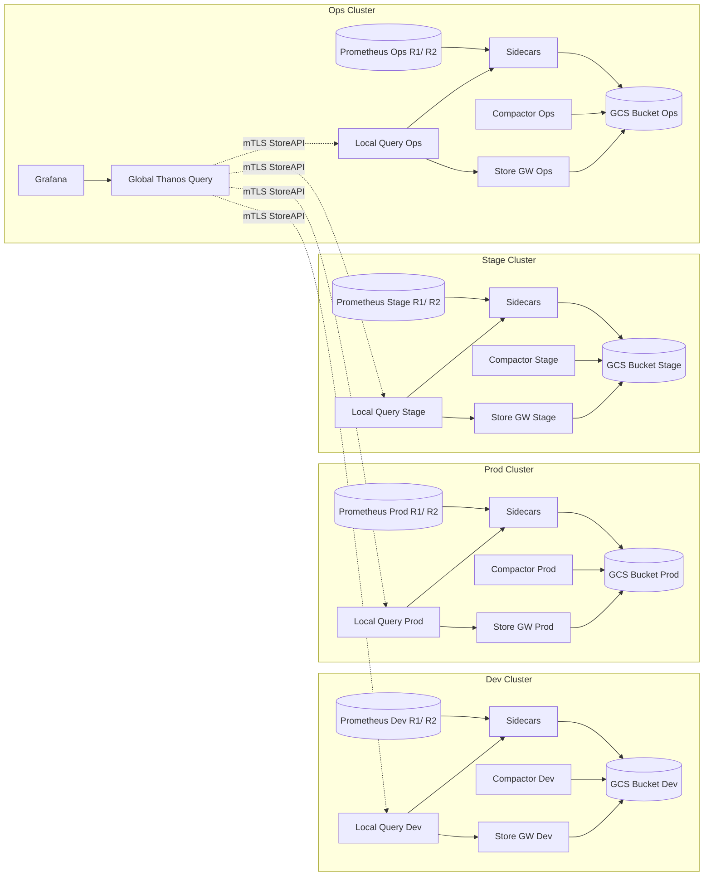
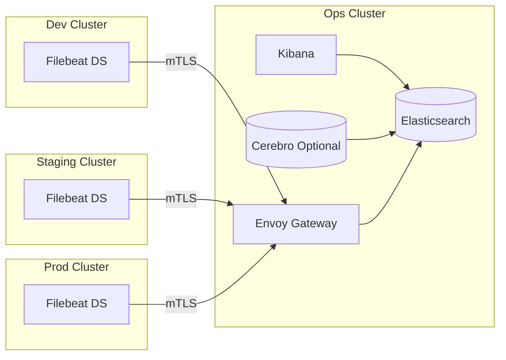
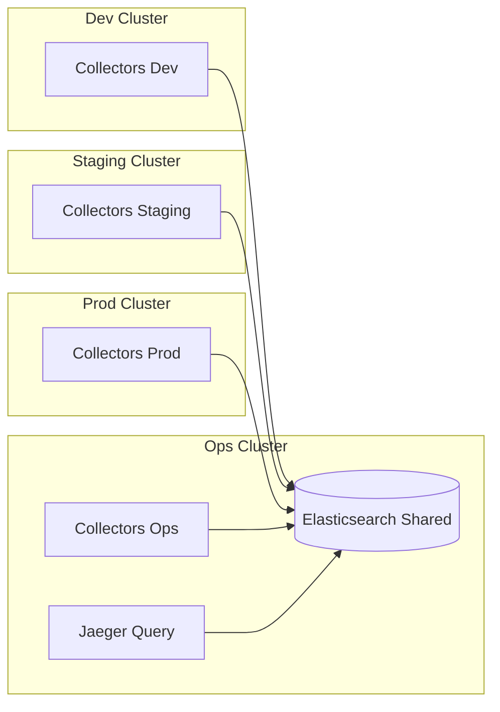
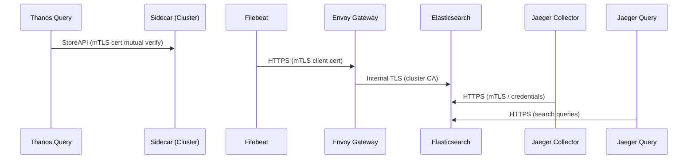

# Building a Global Observability Platform (Metrics, Logs, Traces) Across Multi‑Cluster Kubernetes

A cohesive observability platform unifies metrics, logs, and traces so operators and developers can answer: *Is it slow? Why is it slow? Where did it fail?* This document describes an opinionated, production‑grade, multi‑cluster design using:

- Metrics: HA Prometheus + Thanos (real‑time + long‑term + global aggregation)
- Logs: Elastic Stack (Elasticsearch + Kibana + Filebeat) centralized with secure multi‑cluster shipping
- Traces: Jaeger (distributed collection, centralized query) backed by the SAME Elasticsearch cluster (shared storage layer)
- Secure transport everywhere via mTLS (Gateway API / gRPC / StoreAPI)

> Goal: A single logical pane of glass (Grafana + Kibana + Jaeger Query UI) without tightly coupling clusters or sacrificing blast radius isolation.

## Prerequisites (Assumed Running)
The design (and the steps below) assume the following platform components are already deployed and healthy in each relevant cluster (usually via your App‑of‑Apps / GitOps root):
- Envoy Gateway (Gateway API) – for secure ingress (gRPC / HTTPS) endpoints used by Thanos Query (optional), log shipping (Filebeat -> Gateway), and potential Jaeger Query exposure.
- cert-manager (+ reflector if you mirror certs) – for issuing TLS server certificates and mTLS client certs.
- Sealed Secrets controller – for distributing encrypted credentials (object storage creds, ES auth, TLS private keys, client certs).
- external-dns – to automate DNS records for exposed observability endpoints (Grafana, Kibana, Thanos Query, Jaeger Query, log ingest, etc.).

Ensure cluster trust roots / CA issuers are consistent (or mapped) so mTLS pairs validate correctly across clusters.

## GitOps App-of-Apps Integration (Foundational)
This platform is bootstrapped by the existing Helm chart at `charts/app-of-apps` (your published **App-of-Apps** implementation). That chart renders Argo CD `Application` objects for every core and observability component based on simple boolean `enable` flags and per‑environment value files (`values.dev-01.yaml`, `values.stag-01.yaml`, `values.prod-01.yaml`, `values.ops-01.yaml`).

### Key Capabilities
- Single helm install creates (or updates) all Argo CD Applications for a cluster
- Per‑environment git revision selection (`source.targetRevision`) allowing progressive promotion (e.g. `HEAD` → `staging` → `stable`)
- Toggle components on/off via `<component>.enable`
- Uniform naming convention: `<cluster.name>-<component>` (e.g. `dev-01-monitoring`)
- Centralized team/cluster labeling for governance & search (labels: `team: ops`, `cluster: <cluster>`) 
- Safe sync (auto `CreateNamespace=true`, validation, self‑heal)

### Environment Value Files
Example (`charts/app-of-apps/values.dev-01.yaml`):
```yaml
cluster:
  name: dev-01
  server: https://dev-01-k8s.endpoint.kubernetes
source:
  targetRevision: HEAD
  helm:
    valueFiles: values.dev-01.yaml
monitoring:
  enable: true
logging:
  enable: true
jaeger:
  enable: true
# ... other components enabled ...
```
Switching promotion simply changes `source.targetRevision` in `values.prod-01.yaml` (e.g. `stable`) while dev tracks `HEAD`.


### Promotion Workflow (End-to-End)
1. Commit change to underlying component chart (e.g. new alert rule in `charts/monitoring`).
2. Bump chart version or just rely on git SHA (Argo CD detects diff) for dev (`HEAD`).
3. Validate in dev cluster dashboards.
4. Update `values.stag-01.yaml` `source.targetRevision` to new tag/branch → merge → Argo sync.
5. After soak, update prod environment file to same revision.

### Observability Specific Value Alignment
Ensure these are consistent across all environment files:
- `monitoring` chart external labels (`cluster`, `environment`) aligned with object store bucket naming.
- `logging` chart index prefix or ILM policy references (if templated).
- `jaeger` chart mode (collectors only vs collectors+query) differentiated by environment (ops cluster hosts query UI).

### Why This Chart Matters
The `app-of-apps` chart abstracts: naming, repo URLs, finalizers, sync options, and per‑cluster targeting—removing repetitive Argo CD YAML boilerplate and letting platform engineers focus on chart evolution (monitoring, elastic-stack, jaeger, etc.) rather than Application plumbing.

### Health / Drift Observability
Argo CD UI groups Applications by name prefix `<cluster>-`; quick visual scan shows which cluster component diverged. Label selectors (`team=ops`, `cluster=dev-01`) allow automated tooling (metrics export or notifications) to surface drift or sync lag per environment.

---
## Getting Started: Deployment & Integration Steps
High‑level order minimizes rework and validates each layer before global federation.

### 0. Plan & Prepare
1. Choose environment naming convention (e.g. dev-01, stag-01, prod-01, ops-01).
2. Create (or confirm) per-cluster object storage buckets for Thanos (e.g. `thanos-dev`, `thanos-prod`) with lifecycle rules (downsample retention tiers).
3. Decide Elasticsearch topology (node counts, storage class, ILM policies, index prefixes: `logs-*`, `jaeger-span-*`).
4. Define DNS hostnames (e.g. `thanos-query.example.com`, `kibana.example.com`, `logs-ingest.example.com`, `jaeger.example.com`).
5. Generate (or configure cert-manager Issuers for) TLS certificates + client certs. For mTLS you will need:
   - Server cert(s) for Gateway listeners
   - Client cert/key per shipping component (Filebeat) and per Thanos Query (if cross-cluster gRPC)
   - CA bundle for verification

### 1. Secrets & Credentials (All Clusters Where Needed)
Use Sealed Secrets (or secret management pipeline) to commit:
- Thanos object storage credentials (service account JSON / access keys) – each cluster.
- Elasticsearch credentials (user/password or API key) – clusters running Jaeger Collectors and Filebeat (if using ES auth besides mTLS).
- TLS materials: server cert/key (Gateway) + client cert/key + CA bundle (per function: metrics, logs, traces).
- Optional OAuth / SSO secrets (Jaeger Query, Grafana, Kibana if behind auth proxy).

Apply sealed secrets first so subsequent chart syncs mount them cleanly.

### 2. Deploy Logging (Ops Cluster First)
1. Sync `elastic-stack` chart in Ops cluster (ECK operator + ES + Kibana).
2. Verify ES green status & Kibana reachable (internal first).
3. Apply ILM policies & index templates (`logs-*`, `jaeger-span-*`).
4. (Optional) Expose Kibana via Gateway & confirm external-dns created DNS record.

### 3. Enable Log Shipping (Remote Clusters)
1. Deploy Filebeat DaemonSet (via `elastic-stack` values for remote mode or a lightweight shipper chart) in each non‑Ops cluster.
2. Provide mTLS client cert + CA secret references.
3. Point Filebeat output to Gateway hostname (e.g. `logs-ingest.example.com:443`).
4. Validate ingestion: indices for each environment appear (e.g. `logs-dev-01-*`).

### 4. Deploy Metrics Stack (All Clusters)
1. Sync `monitoring` chart in each cluster with `prometheus.replicaCount=2`, `thanos.enabled=true`.
2. Ensure sidecars start and initial blocks appear in that cluster's object storage bucket (check bucket path or Thanos metrics: `thanos_sidecar_uploads_total`).
3. Deploy per‑cluster Thanos Compactor (chart values) – operates only on that cluster’s bucket.
4. Deploy per‑cluster Store Gateway.
5. Deploy per‑cluster (local) Thanos Query (optional external exposure; primarily for internal fan‑out to sidecar + store gateway).
6. Deploy a single Global Thanos Query (Ops) – secure via mTLS to the per‑cluster local Query endpoints ONLY (not directly to sidecars / store gateways).
7. Configure Grafana datasource pointing to Global Thanos Query endpoint.
8. Validate multi‑cluster view: query `up{cluster="dev-01"}` across clusters.

### 5. Deploy Tracing (Jaeger)
1. In Ops cluster: Deploy Jaeger chart with Query + Collectors (`jaeger.query.enabled=true`).
2. In each non‑Ops cluster: Deploy Collectors only (Query disabled).
3. Configure all Collectors to use Elasticsearch (host, credential secret, mTLS secret).
4. Optionally deploy Agents only where apps lack native OTLP.
5. Run Jaeger ES rollover / ILM init job (once) if not already executed.
6. Expose Jaeger Query via Gateway (TLS) and confirm DNS & cert.

### 6. Cross‑Cutting Validation
| Check | Command / Method | Success Criteria |
|-------|------------------|------------------|
| Prometheus HA | `kubectl get pods -n monitoring` | 2 Ready pods per cluster + sidecars running |
| Thanos shipping | Grafana: `thanos_shipper_uploads_total` | Steady increase; no persistent failures |
| Global metrics | Grafana query across `cluster` label | Results from all clusters |
| Log ingestion | Kibana Discover | Logs from each cluster index present |
| Traces written | Jaeger UI search | Spans visible from test app |
| mTLS integrity | Inspect sidecar / Filebeat logs | No handshake / cert errors |
| ILM rotation | ES `_ilm/explain` | Hot → Warm transitions appear as policy dictates |

### 7. Hardening & Production Readiness
- Add alert rules (PrometheusRule) for: sidecar upload failures, ES disk >80%, filebeat output errors, jaeger collector queue saturation.
- Implement NetworkPolicies restricting access to Gateway ingest ports.
- Enforce TLS minimum versions & strong cipher suites at Gateway.
- Implement role‑based access: limit Kibana & Jaeger UI to SSO groups.
- Configure Grafana folder structure + RBAC (dashboards per domain/team).

### 8. Ongoing Operations
| Activity | Frequency | Notes |
|----------|-----------|-------|
| TLS cert rotation | 60–90 days | Automate via cert-manager + Sealed Secret updates |
| Object storage lifecycle review | Quarterly | Optimize retention versus cost |
| ES shard / index review | Monthly | Prevent oversharding; adjust templates |
| Capacity planning (metrics / logs) | Quarterly | Track growth; forecast storage & ingestion rates |
| Policy review (ILM / retention) | Quarterly | Align with compliance & cost constraints |

---
## 1. Metrics Architecture (Prometheus + Thanos)
Each workload cluster runs: (a) an HA Prometheus pair (each replica with its own Sidecar), (b) a per‑cluster Compactor, (c) a per‑cluster Store Gateway, and (d) a per‑cluster *local* Thanos Query that federates ONLY in‑cluster components. A single *Global* Thanos Query (in the Ops cluster) fans out over mTLS to the local Query instances (one hop), rather than directly to every sidecar / store gateway. This reduces the number of cross‑cluster mTLS targets and cleanly encapsulates each cluster’s internal topology.



Key Points:
- Local Query per cluster encapsulates in‑cluster sidecars & store gateway; only one mTLS endpoint per cluster is exposed globally.
- Global Query (QG) fans out to local queries, reducing connection surface vs. directly addressing every sidecar / store gateway.
- Per‑cluster buckets isolate credentials, retention & lifecycle; compactors & store gateways never cross cluster boundaries.
- Deduplication still functions (external labels must uniquely identify `cluster` and `replica`).
- Grafana points ONLY to Global Query for a unified pane.

Legend: Local Query = in‑cluster fan‑out; Global Query = cross‑cluster aggregator; Sidecars = live + block shipping; Store GW = historical block index; Compactor = cluster‑scoped downsampling.

---
## 2. Logging Architecture (Elastic Stack Centralization)
Logs from all clusters flow to a single Elasticsearch domain in the Ops cluster. Filebeat (or other shippers) in remote clusters sends over mTLS through an Envoy Gateway. Kibana provides exploration & dashboarding; optional Cerebro for cluster internals.



Key Points:
- Only a controlled Gateway listener is exposed; ES internals stay inside Ops cluster.
- Per‑cluster client certificates allow revocation & isolation.
- ILM policies manage retention tiers (hot → warm → delete) controlling cost.

---
## 3. Tracing Architecture (Jaeger + Shared Elasticsearch)
Jaeger reuses the Elasticsearch cluster used for logs (operational & cost efficiency). Collectors are deployed in every cluster; the Query UI only in the Ops cluster. Agents are optional: prefer direct OTLP export when possible.



Key Points:
- Single storage backend reduces operational overhead (one index lifecycle strategy for both logs & traces).
- mTLS / credentials isolate ingest path (collectors authenticate to ES via sealed secrets + client certs).
- Query UI can be fronted by OAuth proxy for SSO.

---
## 4. Unified Data Layer & Access Strategy
| Concern | Metrics | Logs | Traces |
|---------|--------|------|--------|
| Hot Path | Local Prometheus TSDB | Ingest pipeline (Filebeat -> ES) | Collector batching -> ES |
| Long‑Term | Thanos (object storage) | ES ILM warm tier | ES ILM indices | 
| Global Aggregation | Thanos Query | Kibana (single ES) | Jaeger Query (same ES) |
| Transport Security | mTLS StoreAPI / gRPC | mTLS (Gateway) | mTLS to ES | 
| User Interface | Grafana | Kibana | Jaeger UI |

Sharing Elasticsearch for logs & traces decreases system sprawl but requires ILM planning (separate index prefixes: e.g., `logs-*`, `jaeger-span-*`).

---
## 5. Security & mTLS Overview


Principles:
- Separate PKI roots for metrics vs log/trace pathways if revocation domains differ.
- Short lifetime certs + automated renewal (cert-manager + reflector) for dynamic endpoints.
- Least privilege: distinct ES users / API keys for collectors vs query components.

---
## 6. Operational Playbook (Highlights)
| Task | Action | Tooling |
|------|--------|---------|
| Add new cluster | Deploy Prometheus + Sidecar + Filebeat + Jaeger Collector; register certs; add DNS for Gateway | Helm / Argo CD |
| Rotate certs | Update SealedSecrets / cert-manager Issuer; allow rolling restart | cert-manager / Argo sync |
| Expand retention (metrics) | Adjust Thanos compactor retention flags & object store lifecycle | Thanos / GCS console |
| Expand retention (logs/traces) | Update ES ILM policies & storage class sizing | ECK / ILM APIs |
| Investigate latency | Use Grafana (SLO panels) → Jump to Kibana logs → Correlate trace in Jaeger | Cross-tool drilldown |
| Outage isolation | Thanos Query continues with healthy clusters; ES ingest unaffected by one cluster's failure | Redundant topology |

---
## 7. Value Overrides & Configuration Tips
- Prometheus: `replicaCount=2`, anti‑affinity, remote write avoided (use Thanos instead).
- Thanos: **Per cluster:** Sidecars (per replica), Compactor, Store Gateway, Local Query. **Global:** one aggregator Query (no compactor / store GW). Distinct object storage config secret per cluster (e.g., `objstore-dev.yaml`). External labels must include `cluster` + `replica`; ensure local Queries and global Query share consistent relabeling.
- Bucket Layout: Keep per‑cluster bucket names or prefixes; enforce retention (object lifecycle) aligned with compliance; optional different downsampling windows per environment.
- Elasticsearch: Distinct index templates: `logs-*`, `jaeger-span-*` with tuned shard counts.
- Jaeger: Set `es.use-ilm=true` and consistent `index-prefix` per environment (e.g., `jaeger-dev`, `jaeger-prod`).
- Certificates: Use wildcard + dedicated mTLS client certs (separate SealedSecrets) to narrow blast radius.

## 8. Failure Modes & Resilience
| Component | Failure | Impact | Mitigation |
|-----------|---------|--------|-----------|
| Single Prometheus replica | Pod loss | Minor scrape gap | Run 2 replicas + sidecar per replica |
| Thanos Sidecar outage | Fresh data from that replica missing + partial global view | Alerts on ship lag; restart sidecar |
| Per‑cluster Compactor outage | Delayed downsampling / higher bucket usage (that cluster only) | Alert on compaction lag; restart |
| Per‑cluster Store Gateway outage | Loss of historical blocks (> local retention) for that cluster only | Query still hits sidecars; alert & restart gateway |
| Per‑cluster object storage outage | No new block uploads + historical unavailable for that cluster | Local Prometheus hot data still queryable; retry after restore |
| Envoy Gateway down (ingress) | Remote log shipping halts | Buffer limited (Filebeat); HA Gateway / multi AZ |
| ES hot node failure | Potential write throttling | Multi‑AZ nodeSets + ILM; autoscale / shard relocation |
| Jaeger Collector down | Span loss if app side buffering low | Horizontal collectors + backpressure tuning |

## 9. Drilldown Workflow Example
1. Alert fires (Grafana) for increased p99 latency.
2. Open related dashboard → Identify service & timeframe.
3. Pivot to Kibana with label filters (correlated trace ID if propagated).
4. Open Jaeger trace from log field to visualize critical path.
5. Identify downstream dependency slowness → escalate owning team.

---
## 10. Summary
This design delivers:
- High availability + horizontal scalability for metrics.
- Centralized, secure log & trace storage with shared operational surface area.
- Strong encryption-in-transit boundaries (mTLS everywhere).
- Cost efficiency via object storage (metrics) + ILM (logs/traces).
- Clear multi‑cluster federation without compromising isolation.

Adopt incrementally: start with metrics federation, then centralize logging, finally converge tracing onto shared Elasticsearch with ILM governance.

