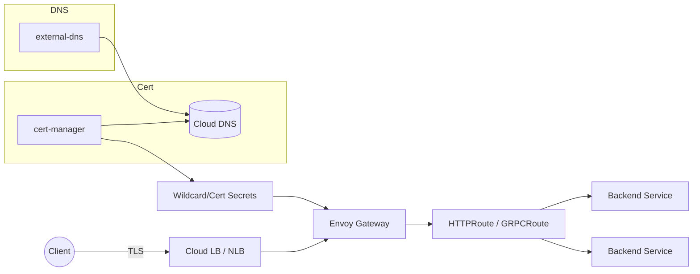
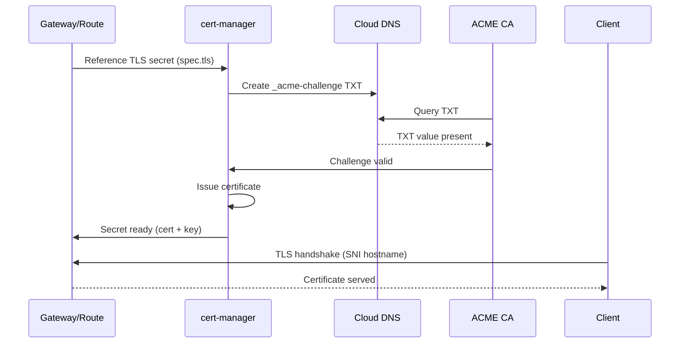
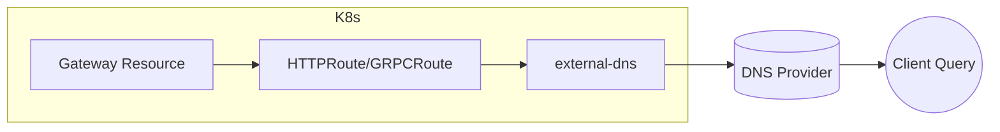

# Unified Traffic Management (Gateway API, Certificates, DNS) Across Multi‑Cluster Kubernetes

This document describes an opinionated, production‑grade, multi‑cluster traffic management stack using:

- Envoy Gateway (Gateway API) for north/south HTTP(S) & gRPC ingress, policy attachment, and progressive routing
- cert-manager (DNS‑01 + optional reflector) for automated TLS (wildcard/SAN) issuance & mTLS materials
- external-dns for dynamic DNS record management (Gateway hostnames, legacy ingress fallbacks)
- Sealed Secrets for distributing sensitive credentials (ACME DNS provider secrets, client certs) declaratively

> Goal: A consistent, GitOps‑managed edge that enables secure, automated, encrypted, and observable entry points per environment while minimizing snowflake configuration.

## 1. Prerequisites (Core Platform Components)
Deployed via the App‑of‑Apps chart (`charts/app-of-apps`) with the following flags enabled in each environment values file as needed:
- `sealedSecrets.enable`
- `certManager.enable`
- `envoyGateway.enable`
- `externalDns.enable`

Other supporting components (monitoring, logging, jaeger) enhance observability but are not required for basic edge operation. Ensure:
- Cluster has Argo CD registration (managed centrally from ops cluster)
- Cloud DNS / Route53 / other provider credentials sealed (for DNS‑01 + external-dns)
- Wildcard domain(s) allocated per environment (e.g. `*.dev.example.com`, `*.prod.example.com`)

## 2. GitOps App-of-Apps Integration
The traffic stack is declared by the `app-of-apps` chart which renders one Argo CD Application per component using environment value files (`values.dev-01.yaml`, etc.). Promotion between branches / tags (`dev` → `staging` → `stable`) automatically advances all three components in lock‑step unless overridden per component block.

Key advantages of the pattern for traffic:
- Deterministic ordering (sync waves) so cert-manager + CRDs are healthy before Gateway TLS references
- Uniform label schema (`cluster: <name>`, `team: ops`) aiding audit & policy
- Per‑environment Git revision control for safe soak (staging) prior to production tagging

### Suggested Sync Waves
| Wave | Component | Rationale |
|------|-----------|-----------|
| -1 | sealed-secrets | Secrets (ACME DNS creds, client keys) ready first |
| 0 | cert-manager (+ reflector) | Issue certs before Gateway mounts them |
| 1 | envoy-gateway CRDs & controller | Core routing plane |
| 2 | external-dns | Publishes records after Gateway objects exist |
| 3 | Route / HTTPRoute / GRPCRoute apps | Dependent workloads / hostnames |

Add annotations (example) in `charts/app-of-apps/values.<env>.yaml`:
```yaml
envoyGateway:
  enable: true
  annotations:
    argocd.argoproj.io/sync-wave: "1"
certManager:
  enable: true
  annotations:
    argocd.argoproj.io/sync-wave: "0"
externalDNS:
  enable: true
  annotations:
    argocd.argoproj.io/sync-wave: "2"
sealedSecrets:
  enable: true
  annotations:
    argocd.argoproj.io/sync-wave: "-1"
```

## 3. High-Level Architecture


Key Points:
- Single Gateway instance (per cluster) fronts multiple logical hostnames / routes.
- Wildcard cert secrets injected *after* issuance; Gateway references stable secret names.
- external-dns reconciles desired hostnames from Gateway/HTTPRoute resources into provider records.
- Prefer **external-dns annotations on individual HTTPRoute / GRPCRoute objects**, not on the parent Gateway, when using wildcard hostnames on the Gateway. This ensures DNS records map only to the concrete route hosts actually in use (avoids publishing overly broad / unused wildcard apex records).
- Generate and manage TLS via **explicit `Certificate` Custom Resources** (one per wildcard or SAN set) instead of relying on inline Gateway annotations. This yields deterministic lifecycle (status conditions, renewal window metrics) and clearer Git diffs.

## 4. Certificate Issuance Flow (DNS‑01)


Notes:
- Reflector (if used) replicates the issued secret across namespaces requiring the same cert.
- Renewals repeat silently; Gateway hot‑reloads cert from Secret update.

## 5. DNS Record Automation Flow


external-dns watches Gateway API objects (depending on provider implementation) OR Services annotated with `external-dns.alpha.kubernetes.io/hostname`. When a Gateway uses a wildcard (`*.dev.example.com`), place the specific `external-dns` hostname annotations on each **HTTPRoute** that introduces an actual concrete host (e.g. `app1.dev.example.com`) to avoid publishing catch‑all or unnecessary records tied only to the wildcard Gateway. It applies idempotent A/AAAA + TXT registry records. Changes propagate via normal DNS TTL.

## 6. Deployment Steps (Per Environment)
1. **Secrets**: Seal ACME DNS provider credentials + any client cert keys (`sealed-secrets` wave -1).
2. **cert-manager**: Sync controller + issuers (ClusterIssuer wildcard + staging/production ACME endpoints).
3. **Envoy Gateway**: Sync CRDs, controller, base Gateway (no TLS errors if secret pending—Gateway loads once ready).
4. **external-dns**: Sync with provider credentials; confirm it creates/updates TXT registry records.
5. **Routes**: Apply HTTPRoute / GRPCRoute referencing hostnames covered by issued wildcard cert.
6. **Validation**: Curl / browser test host; confirm valid certificate chain & expected backend responses.
- For certificates: commit `Certificate` CRs (wildcard + SAN as needed) early so Gateway simply references `secretName`; avoid ad‑hoc annotations on the Gateway for issuance triggers.

## 7. Security & Policy Considerations
| Concern | Control | Implementation |
|---------|---------|----------------|
| TLS Private Keys | Encrypted at rest, limited namespace | Sealed Secrets + namespace scoping |
| Wildcard Cert Misuse | Restrict reflection | Reflector label selectors / avoid broad replication |
| DNS Hijack | TXT registry + IAM least privilege | external-dns: scoped DNS zone IAM role |
| Certificate Issuance Abuse | Separate staging vs prod ACME issuers | Distinct ClusterIssuers, promotion gating |
| Route Sprawl | Label & policy guardrails | Kyverno policies restricting host patterns (e.g., must end with env domain) |
| Deterministic Cert Lifecycle | Explicit Certificate CRs (no implicit annotations) | Git-managed `Certificate` objects per domain/wildcard |
| mTLS for Internal Services | Separate cert chain | Additional issuer (internal CA) for service mesh or backend mTLS |

## 8. Value Overrides & Configuration Tips
| Component | Key Values | Notes |
|----------|------------|-------|
| cert-manager | `clusterIssuer.email`, `issuer.acme.server`, `solvers.dns01` | Use staging server first; ensure DNS propagation fast (low TTL) |
| Certificates (CRs) | `spec.dnsNames`, `spec.secretName`, `issuerRef` | Define once per wildcard/SAN; Gateway references `secretName` only |
| Envoy Gateway | `gateway.listeners`, `gateway.hosts`, `provider.runtime` | Keep minimal listeners; prefer HTTPS only |
| Envoy Gateway TLS | `tls.secretName` (wildcard) | Reference stable secret name; do not embed cert data inline |
| external-dns | `domainFilters`, `policy`, `txtPrefix` | Domain filter prevents accidental cross‑zone writes; annotate Routes not Gateway for wildcard usage |
| Sealed Secrets | Controller scope keys | Rotate keys annually; commit only sealed form |
| Reflector (optional) | `allowNamespaces`, labels | Explicit allowlist to avoid secret sprawl |

## 9. Operational Playbook
| Task | Action | Tooling |
|------|--------|---------|
| Add domain | Add DNS zone + update `domainFilters`; apply new wildcard issuer | Git + Argo CD sync |
| Rotate wildcard cert | Force renew (`kubectl annotate certificate <name> ...`) | cert-manager CLI / kubectl |
| Add new route | Commit HTTPRoute YAML; Argo sync; external-dns adds record | GitOps flow |
| Migrate service | Deploy new backend Service + update Route backendRefs | Helm / Argo CD |
| Audit DNS drift | Compare desired hosts (Gateway/Route) vs zone | Script using `kubectl get` + provider API |
| Enforce host policy | Add Kyverno rule on HTTPRoute host regex | Kyverno chart values |

## 10. Failure Modes & Resilience
| Component | Failure | Impact | Mitigation |
|-----------|---------|--------|-----------|
| cert-manager pod down | No new / renewed certs | Alerts on cert expiry window | HA replicas / restart |
| ACME DNS provider outage | Challenge fails / delays issuance | Retry backoff | Pre-warm staging certs |
| external-dns failure | Stale DNS records | Existing traffic unaffected | Alert on sync age metric |
| Envoy Gateway pod loss | Connection resets / brief outage | HA replicas + PDB + anti-affinity |
| Secret deletion | TLS fallback/handshake fail | Argo CD drift detection recreates secret (if sealed) |
| Wildcard expiry | Clients see expired cert | Alert 15–20 days before expiry | Forced renew playbook |

## 11. Drilldown Example (Cert Issue Delay)
1. Alert: certificate expires in < 3d.
2. Inspect `Certificate` status (`kubectl describe certificate <name>`).
(Add check) 2a. If Gateway annotated for cert issuance: migrate to explicit `Certificate` CR referencing same `secretName` for better status visibility.
3. Check `Order` / `Challenge` resources for stuck state.
4. Validate `_acme-challenge` TXT via `dig`.
5. If DNS missing: inspect external-dns logs vs cert-manager solver logs.
6. Reconcile: fix DNS credentials secret / permissions; annotate certificate to trigger renew.

## 12. Promotion & Branching Alignment
- `dev` branch: fastest iteration on Gateway routes & test domains (short TTL).
- `staging` branch: soak route changes & new wildcard certs before production tag.
- `stable` tag: production clusters (`prod-01`, `ops-01`) reconcile known‑good versions of all three charts.
- To introduce a new domain or issuer: land in `dev` → promote to `staging` → after validation cut/move `stable`.

## 13. Summary
This integrated traffic layer delivers:
- Automated, repeatable TLS (wildcard + optional internal) issuance via explicit Certificate CRs
- Declarative DNS record lifecycle bound to Gateway API resources (per-route annotations for wildcard Gateways)
- Consistent multi‑cluster edge with environment isolation & fast promotion
- Secure secret handling (Sealed Secrets) and optional scoped replication
- Predictable branching/tag model consistent with the broader platform (observability, policies, data services)

Adopt incrementally: enable cert-manager + sealed-secrets first, then Envoy Gateway, then external-dns, then progressively migrate legacy ingress objects to Gateway API.


